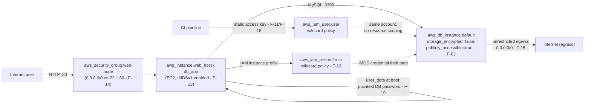

# Threat Modeling Exercise — Module 9

**Workload chosen:** the AWS web application + database workload defined across `terraform/aws/ec2.tf` and
`terraform/aws/db-app.tf` — a public-facing EC2 web host, an application-tier EC2 instance (`db_app`) running PHP
that talks to a MySQL RDS instance, fronted by an IAM instance role. Chosen because it's the richest single workload
in the reference repo and ties directly to the largest cluster of findings already documented (F-03, F-11–F-15,
F-19, F-21).

**Methodology:** STRIDE, applied per major component and trust boundary crossing.

## Data flow diagram (simple, diagram-as-code — not the HLD/LLD from Section 8)

## Threats identified (STRIDE)

| # | STRIDE category | Threat | Likelihood | Impact | Control (existing or proposed) |
|---|---|---|---|---|---|
| T1 | **Spoofing** | An attacker connects directly to the RDS instance pretending to be the application, since it's `publicly_accessible = true` (F-03) and reachable without going through the web tier at all. | High — the instance is reachable today with no network barrier | High — direct database access bypasses every application-layer control | *Proposed:* `publicly_accessible = false` + Data-tier network isolation (Module 4), so the database is unreachable except from the Application tier by reference, not by routable address. |
| T2 | **Spoofing** | The CI pipeline's static IAM access key (F-11/F-18) is used by someone other than the pipeline — nothing about the credential itself proves who's using it, since it's a long-lived shared secret. | Medium — requires the key to leak first, but three separate hardcoded-key findings (F-18) show this estate has a pattern of exactly that | Critical if it happens | *Proposed:* OIDC workload identity federation (Module 3) — the credential is bound to a specific pipeline/branch identity at request time, not a bearer secret anyone holding it can use. |
| T3 | **Tampering** | The EC2 `user_data` script writes the database password into a plaintext PHP include file (F-19) — anyone who gains any file-read access to the instance, or who can read the user-data via the EC2 API, can tamper with or exfiltrate application behaviour using that credential. | Medium | High — full database credential exposure, not just read access to one resource | *Existing:* none. *Proposed:* inject the credential at runtime from Secrets Manager/Parameter Store instead of baking it into user-data; user-data itself should never contain a credential value. |
| T4 | **Tampering** | The two wildcard IAM policies (F-11, F-12) permit `s3:*`/`ec2:*`/`rds:*` on `Resource:"*"` — a compromised credential can modify infrastructure state itself (e.g. change a security group, alter the RDS instance), not just read data. | Medium | Critical — this is infrastructure tampering, not just data exposure | *Proposed:* tag-scoped policy replacing both wildcard grants (Module 3, applied concretely in [07-remediation/fixed-terraform/iam-scoped-policy.tf](../07-remediation/fixed-terraform/iam-scoped-policy.tf)). |
| T5 | **Repudiation** | No CloudTrail resource exists anywhere in this codebase (F-21) — if any of the above occurred, there is currently no audit trail to prove what happened, when, or by which identity. | High — this isn't a probability, it's a current, confirmed absence | High — every other finding's investigability depends on this being fixed | *Proposed:* centralised CloudTrail + SIEM ingestion (Module 6). Until then, every threat in this table is **also** unattributable if it occurs. |
| T6 | **Information Disclosure** | The application database has `storage_encrypted = false` (F-03/F-07) — any successful read access (via T1, or via a compromised application-tier instance) yields plaintext data with no additional barrier. | High given T1's likelihood | High — direct plaintext exposure of application/customer data | *Proposed:* KMS-encrypted storage (Module 5, [07-remediation/fixed-terraform/rds-encrypted-private.tf](../07-remediation/fixed-terraform/rds-encrypted-private.tf)). |
| T7 | **Information Disclosure** | IMDSv1 is enabled on both EC2 instances (F-13) — a server-side request forgery vulnerability in the PHP application (plausible; the app takes raw POST input into SQL string construction, see `db-app.tf` user-data) could be used to reach the instance metadata endpoint and retrieve the wildcard-policy role's temporary credentials. | Medium — requires an SSRF/injection bug in the app layer to exist first, but the app code shown does minimal input handling | Critical — this is the credential-theft pivot from a web bug straight to T4's infrastructure tampering | *Proposed:* enforce IMDSv2 (`http_tokens = "required"`) so a simple SSRF can no longer retrieve credentials without also satisfying IMDSv2's session-token requirement. |
| T8 | **Denial of Service** | The RDS instance has `multi_az = false` and `backup_retention_period = 0` (F-25) — there is no failover path and no recovery point if the instance becomes unavailable or its data is destroyed (accidentally or via a T4-style tampering event). | Low likelihood of the triggering event itself, but the workload has zero resilience once triggered | High — full data loss with no recovery path, not just downtime | *Proposed:* `multi_az = true`, real backup retention (Module 13 covers this at the estate level). |
| T9 | **Elevation of Privilege** | A compromised application-tier instance (via T1, T3, or T7) inherits the EC2 instance role's wildcard permissions (F-12) — code execution on the web host becomes account-level `ec2:*`/`s3:*`/`rds:*` privilege, not privilege scoped to what a web app should ever need. | Medium | Critical — this is the chain that turns an application bug into an account-wide compromise | *Proposed:* same tag-scoped policy as T4, combined with T7's IMDSv2 fix — both layers of this escalation path need closing, not just one. |

## Threat existing controls do not fully mitigate — honest residual risk statement

**T3 (plaintext database password in EC2 user-data) is only partially mitigated even after the proposed fix.**
Moving the credential to Secrets Manager/Parameter Store at boot removes it from the persistent user-data field, but
the credential still exists in plaintext in the instance's process memory and in the rendered PHP include file on
disk once the instance boots — user-data is the most obvious exposure path, not the only one. Anyone with
shell/console access to the running instance (which several of the threats above, if realised, would grant) can
still read the credential from disk after the fix, same as before. Full mitigation would require either short-lived,
per-session database credentials (e.g. IAM database authentication for MySQL, avoiding a static password entirely)
or a secrets-injection pattern that never writes the value to a persistent file — neither is in scope to implement
here given the maintenance-window constraints already committed to fixing F-03 in the same instance family. This is
recorded as an accepted residual risk pending a follow-up engineering task, not a claim that the pipeline fix in
Module 7 fully closes T3.
